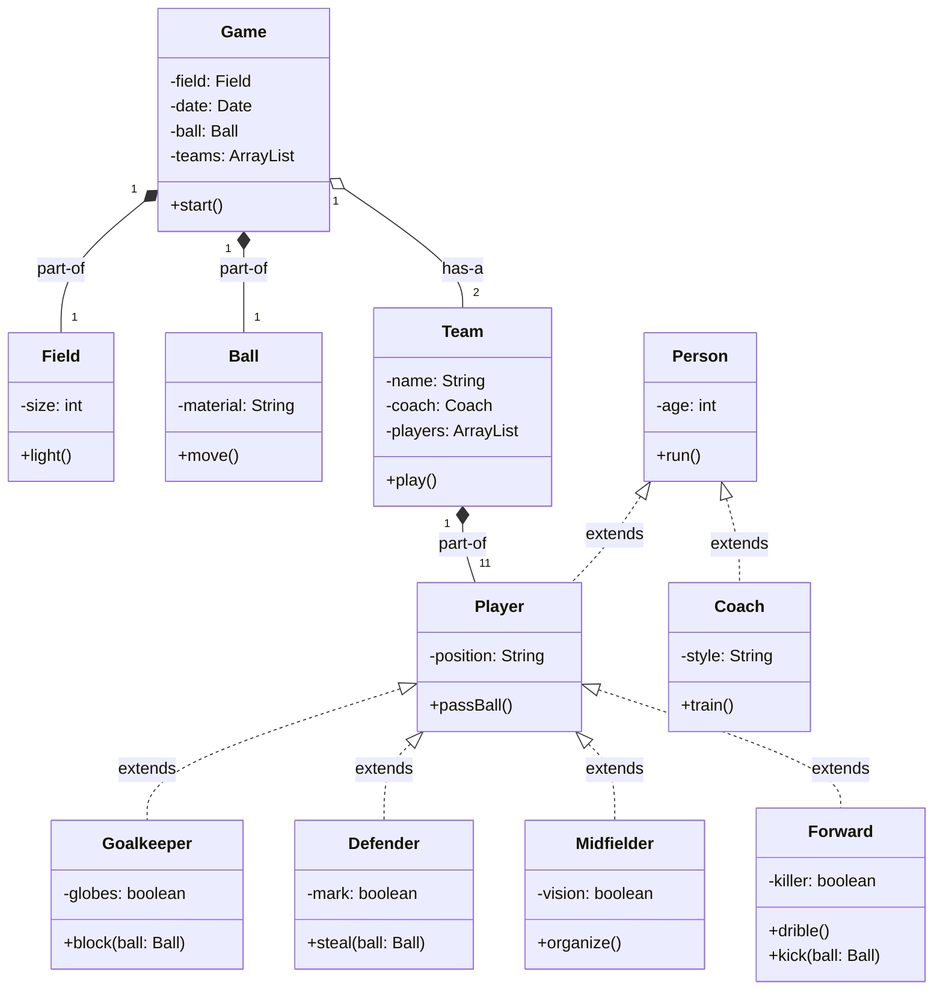

# Goal
* Practice git commands and branching strategy
* Read class diagrams
* Review inheritance concepts
* Review composition/agregation/association relationship
* Teamwork

# Class diagram

# Issue status and team assignment
- Eduard: Issue 1 completed and README updated.
- Gurpi: Issues 2 and 6 completed.
- Roger: Issues 4 and 5 completed.
- Pol: Issues 3 and 7 completed.

# Changes made in the web and teamwork process
The work was organized using GitHub repositories and branches. Each member worked on a different issue, creating independent branches to avoid overwriting the code of other teammates.

## Web changes performed
- A repository was created from the provided template and shared among the group.
- The issues were reviewed and assigned to each member according to the task list.
- Each branch was created from the main project branch to isolate the work of one issue.
- The changes were pushed to the remote repository from each local environment.
- A pull request was opened for each branch to merge the changes into the main branch.
- The team reviewed the requests and checked if there were conflicts or inconsistencies.
- Once the corrections were made, the merge was completed and the final project was reviewed.
- The README was updated to reflect the status and responsibilities of each contributor.

## Procedure followed
1. Create the repository using the provided template.
2. Review the class diagram and the current Java implementation to identify the pending tasks.
3. Assign every issue to a group member.
4. Create one branch per issue.
5. Clone the remote repository in each local environment.
6. Change to the corresponding branch.
7. Implement the code requested in the issue.
8. Save and commit the changes locally.
9. Push the branch to the remote repository.
10. Open a pull request from the member branch to master/main.
11. Review the code and resolve any merge conflicts if necessary.
12. Merge the branch after validation.
13. Confirm that the issue is closed and the project remains consistent.

## Contribution summary
This project shows the complete Git workflow used in a team environment: branch creation, individual development, push, pull requests, conflict resolution, and final merging. The README was also updated to document the current state so that the whole team can see what was done and who was responsible for each task.

# What the code does
This project is a small football simulation written in Java. It models the main elements of a soccer match using object-oriented programming.

- `Game` represents the whole match and contains the field, the date, the ball and the teams.
- `Field` represents the pitch and has its own size.
- `Ball` represents the ball and can move.
- `Team` represents a team and contains the coach and the list of players.
- `Person` is the base class for all people in the system.
- `Player` inherits from `Person` and adds the ability to pass the ball.
- `Coach` inherits from `Person` and represents the trainer.
- `Goalkeeper`, `Defender`, `Midfielder` and `Forward` are specialized player types with different actions.

The main method in `Game` creates two teams, gives them players, assigns a coach and starts the match. Then the program simulates random actions such as running, passing, dribbling, defending, organizing the game or shooting. Each player performs actions based on their role, which shows the use of inheritance and polymorphism in Java.

This project helps practice class design, relationships between classes and teamwork using Git branches and pull requests.

# Implementation
1. Create repository using this template to group git account
2. Check Game Class diagram and current implementation to identify what is pending to do
3. Assign every issue to a group member
4. Create a branch for each issue
5. Clone repository in local environment
6. Check out to corresponding branch
7. Code the change described in issue
8. Push from your local environment to your repository
9. Create a pull request from member branch to master branch
10. Resolve conflicts(if apply)
11. Merge 
12. Review if issue is closed
